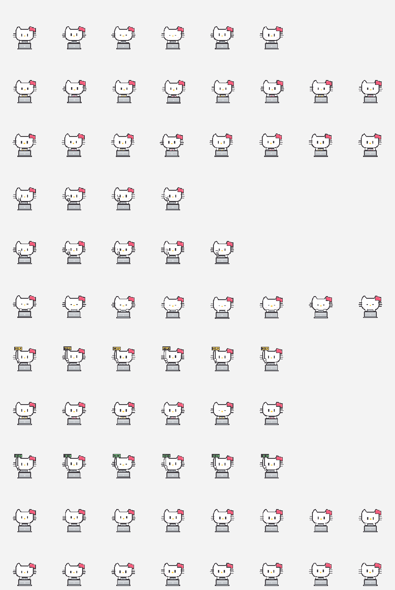

# Pixel Kitty TRAE Pet

A cute pixel-style desktop pet for TRAE CLI / Codex. It blinks while idle, waves on hover, types while work is running, and raises `done` / `help` signs for completion or assistance states.



## Install

Clone or download this repository, then run:

```sh
./install.sh
```

The script installs the pet into:

```text
~/.trae/cli/pets/pixel-kitty
```

After installing, open TRAE settings, refresh custom pets if needed, and select `Pixel Kitty`.

## Files

- `pet.json` - TRAE custom pet manifest.
- `spritesheet.png` - 11-row sprite sheet used by TRAE.
- `contact-sheet.png` - preview of all frames.
- `source/` - Swift scripts used to regenerate and validate the sprite sheet.
- `standalone/` - optional Swift source for the separate floating macOS prototype.

## Sprite Layout

The sprite sheet follows TRAE's current custom pet layout:

- size: `1536 x 2288`
- cell: `192 x 208`
- columns: `8`
- rows: `11`
- version: `4`

Rows map to the built-in states used by TRAE, including idle, running, waving, jumping, waiting, done, help, and look-direction frames.

## Rebuild Assets

To regenerate the sprite sheet and preview:

```sh
./scripts/build.sh
./scripts/validate.sh
```

This uses `xcrun swiftc` on macOS and writes the regenerated files to the repository root.

## Notes

This is an unofficial fan-made pet package for TRAE CLI custom pets. It is not affiliated with or endorsed by any character owner, TRAE, or OpenAI.
